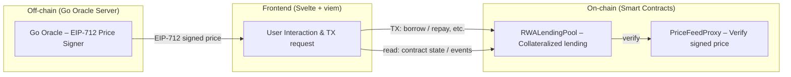

# RWA Lending – RWA 기반 담보 대출 서비스

> EIP-712 서명된 오라클 가격으로 담보 가치를 산정해 차입·상환·청산을 제공하는 온체인 담보 대출 서비스.


## 시스템 구성요소

**On-chain (Smart Contracts)**
- `RWALendingPool`: 오라클 가격 기반 담보·차입·상환·청산 로직(LTV/HF 기준 적용).
- `PriceFeedProxy`: EIP-712 서명 검증, 타임스탬프(최대 지연 `maxDelay`) 검증, `roundId` 단조 증가 검증.
- `RWAAssetToken`: 화이트리스트 기반 전송 제한. 어드민 민트/소각.
- `RWARegistrar`: ADMIN/ISSUER/KYC_MANAGER 롤 및 화이트리스트 관리.

**Off-chain (Go Oracle Server)**
- `GET /price/latest` 제공, EIP-712 ECDSA 서명 포함.
- 도메인(chainId, verifyingContract)이 온체인 `PriceFeedProxy`와 일치하도록 서명하며, 프론트엔드가 pull 방식으로 가져와 트랜잭션에 번들로 포함.

**Frontend (Svelte + viem)**
- 담보 예치/인출, 차입/상환, 청산 UI 제공.
- 사용자 포지션·한도·HF(Health Factor) 계산/표시.
- 오라클 서명을 포함해 트랜잭션 파라미터를 구성하고 지갑에 서명·전송 요청.

## 시스템 아키텍처



---

## 리포지토리 구조

```
contracts/          # Solidity 컨트랙트
oracle-go/          # Go 오라클 서버
app/                # Svelte + Vite + viem 프론트엔드
script/             # Foundry 배포/시드 스크립트
test/               # Foundry 테스트
docker-compose.yml  # Anvil + Oracle + App 구성
foundry.toml        # Foundry 설정
.env.example        # 환경 변수 예시
```

---

## 개발 환경

| 컴포넌트    | 버전                           | 용도                                 |
| -------- | ------------------------------ | ------------------------------------ |
| Foundry  | latest | 컨트랙트/스크립트/테스트 (forge/cast/anvil 포함) |
| Node.js  | 20 LTS                  | 프론트 빌드/개발 서버   |
| Go       | 1.24+                   | 오라클 서버            |
| Docker   | latest | 컨테이너/Compose 실행  |

---

## 환경 변수 (.env)

| 키                | 예시 값                               | 설명                  |
| ---------------- | ---------------------------------- | ------------------- |
| `RPC_URL`        | `http://localhost:8545`            | Anvil/테스트넷 RPC                     |
| `CHAIN_ID`       | `31337`                             | 네트워크 체인ID (Anvil 로그 또는 `cast chain-id --rpc-url $RPC_URL` 확인) |
| `ANVIL_MNEMONIC` | `test test ... junk`               | 개발용 12단어 니모닉                   |
| `PRIVATE_KEY`    | `0x<hex-private-key>`              | 배포·트랜잭션 서명용 (Anvil 로그 또는 `cast wallet private-key "$ANVIL_MNEMONIC" 0` 확인) |
| `FEED_ADDRESS`, `VITE_POOL_ADDRESS` | `0x<pricefeed-address>`, `0x<pool-address>` | 배포 결과 JSON의 PriceFeedProxy·RWALendingPool 주소를 설정 |

---

## 로컬 개발 및 실행

### Foundry 설치

```bash
# 설치 & 확인
curl -L https://foundry.paradigm.xyz | bash && foundryup
forge --version && anvil --version && cast --version

# 의존성 설치/업데이트 (Soldeer)
forge soldeer update
```

### Anvil 실행 및 배포

```bash
source .env
anvil -p 8545 -m "$ANVIL_MNEMONIC"

# 컨트랙트 배포
forge script script/Deploy.s.sol --broadcast --rpc-url "$RPC_URL" --private-key "$PRIVATE_KEY"

# 배포결과 확인 (.env 반영 필요)
cat broadcast/Deploy.s.sol/$(cast chain-id --rpc-url "$RPC_URL")/run-latest.json
```

### 오라클 서버 실행

```bash
cd oracle-go
go run ./cmd/oracle

# 엔드포인트 확인
curl http://localhost:8088/price/latest
```

응답 스키마 예시

```json
{
  "round_id": 1,
  "price": "1000000000000000000",
  "timestamp": 1710000000,
  "signature": "0x..."
}
```

### 프론트엔드 실행

```bash
cd app
pnpm i --frozen-lockfile
pnpm dev

# 접속 확인
# http://localhost:5173
```

---

## Docker Compose 실행

Anvil, 오라클 서버, app 실행 및 `script/Deploy.s.sol` 배포

```bash
# .env 수정 필요
cp .env.example .env
docker compose up -d
```

---

## 테스트

```bash
forge test -vvv --gas-report
```
